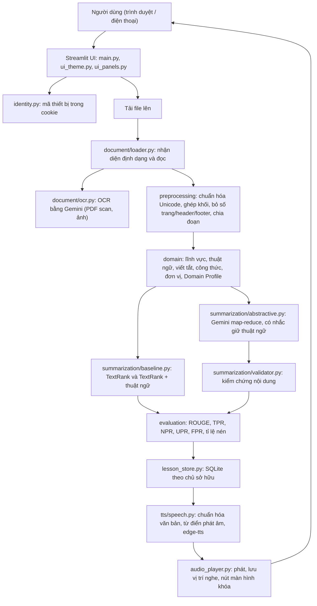
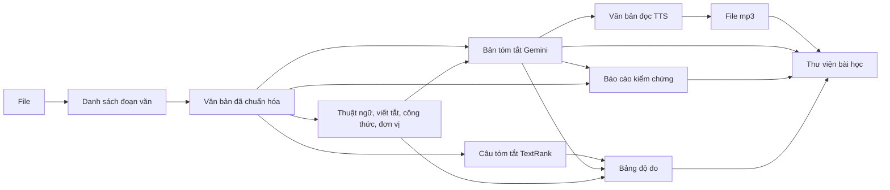
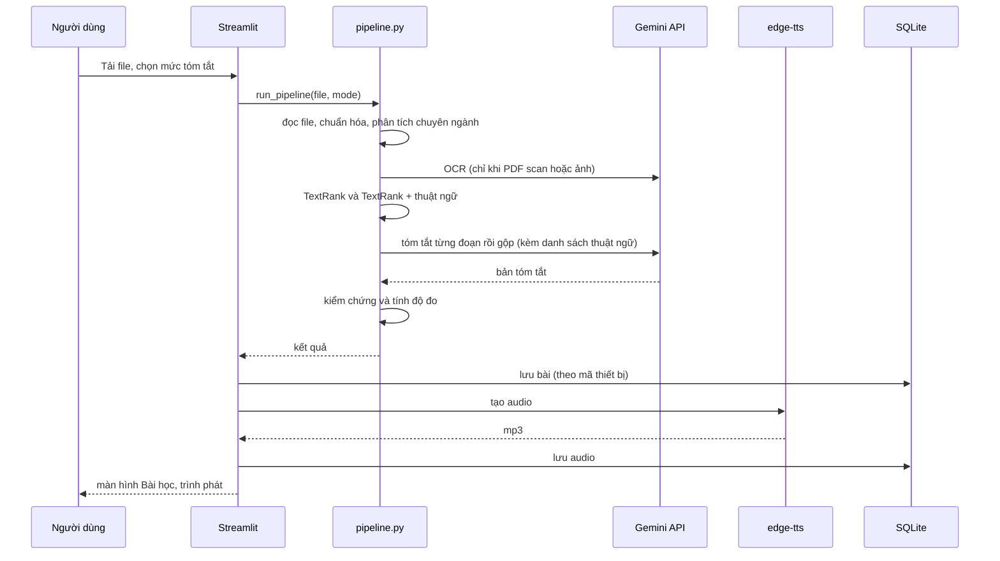
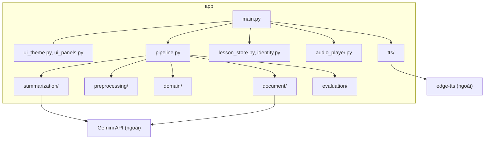

# Kiến trúc hệ thống

Sơ đồ Mermaid mô tả đúng code hiện tại. GitHub tự vẽ khối ` ```mermaid `. Các sơ đồ này **chưa được render thử** trong phiên làm việc; nếu GitHub báo lỗi cú pháp, dán vào https://mermaid.live để tìm dòng sai.

## 1. System Architecture



## 2. Data Flow (chế độ Tóm tắt)



## 3. Sequence Diagram



## 4. Component Diagram



## 5. Phân biệt rule-based và học máy

| Thành phần | Kỹ thuật | Học máy? |
|---|---|---|
| Nhận diện lĩnh vực | Đếm từ khóa có ranh giới từ | Không |
| Thuật ngữ, viết tắt, công thức, đơn vị | Regex và luật | Không |
| Baseline | TF-IDF, cosine, PageRank (TextRank) | Có (không giám sát), không huấn luyện |
| Tóm tắt chính | Gemini pretrained, chỉ inference | Có, **không tự huấn luyện/fine-tune** |
| Kiểm chứng nội dung | Cosine TF-IDF trên cửa sổ 3 câu, so khớp số/đơn vị | Không |
| Bộ phân loại lĩnh vực học máy | (đề xuất, chưa làm) | Sẽ có, huấn luyện có giám sát |
